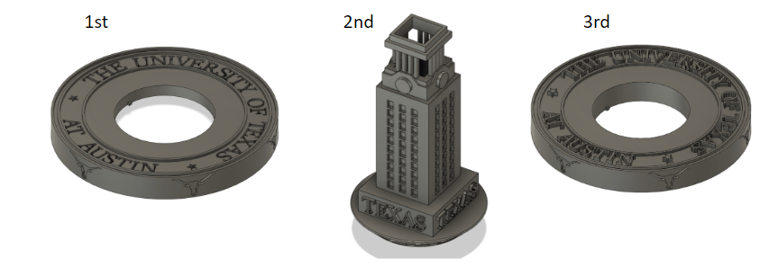

We designed a spinning top that is novel, aesthetically pleasing, durable, spins well, and whose unique fan assembly can only be made using SLS. Our design incorporates a modular top system that allows for interchangeable designs to be attached to the universal base. We designed two UT-themed attachable tops, one that is a replica of the UT model tower and the other that is a replica of the UT seal. The universal base has wind turbine blades in its center so that air can be blown through it to keep it spinning even with a large top installed.  The end result, a unique spinning UT tower and a spinning UT seal both powered by air and that can only be fabricated using SLS.
According to our research, the market for tops ranges from cheap toys with cool designs to expensive over $300 collectors items made of polished metals. The data from our survey suggested customers desired an aesthetically pleasing top that was novel and spun well over all other criteria. And our review of the design specifications of other tops gave us parameters for which to judge our own top.
Using the market, customer, and design specification  information we came up with numerous designs eventually narrowing down our choices to five designs. Then we took our top two designs, the UT tower and an air-powered top, and combined the concepts behind them. With the concept decided upon, we started the design process and iterated through it multiple times until we reached our final design.
To ensure our final design would meet specifications we ran it through various tests. Since the performance of the top heavily depends on its aerodynamics, we prioritized aerodynamic testing. We performed 2-D analysis on each of the blades to determine minimum angle requirements based on inlet air speed and target RPM and then modified the blades accordingly. In future iterations, the blade design could benefit from 3-D analysis and simulation, but for this project we believed 2-D analysis was sufficient. 
Lastly, we calculated the cost to build our top to ensure it was competitive with other high end tops. Our entire top system which includes both the universal base and the two attachable designs only required a build volume of 1024 cm3 (80mm x 80 mm x 160 mm); this is only 1/50th of the build chamber. This volume requires 0.512 kg of Nylon -12 powder which would cost about $11 (50% virgin powder). Depending on the operating cost, the top would cost between $20 and $30, well below the cost of higher end tops and closer to lower end ones.  

The code and final report are available on Github:

https://github.com/yamierick/Engineer_Living/tree/master/SLS%20Project

Key Image

